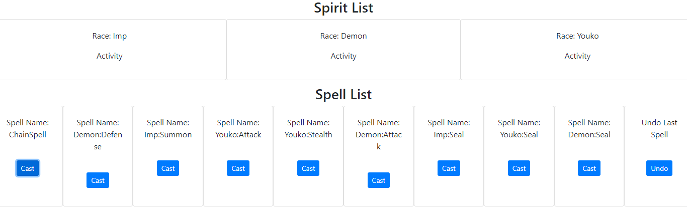
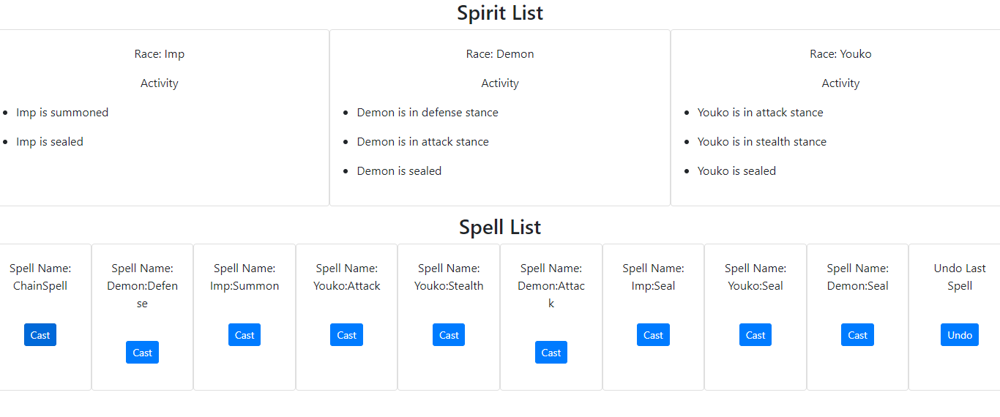
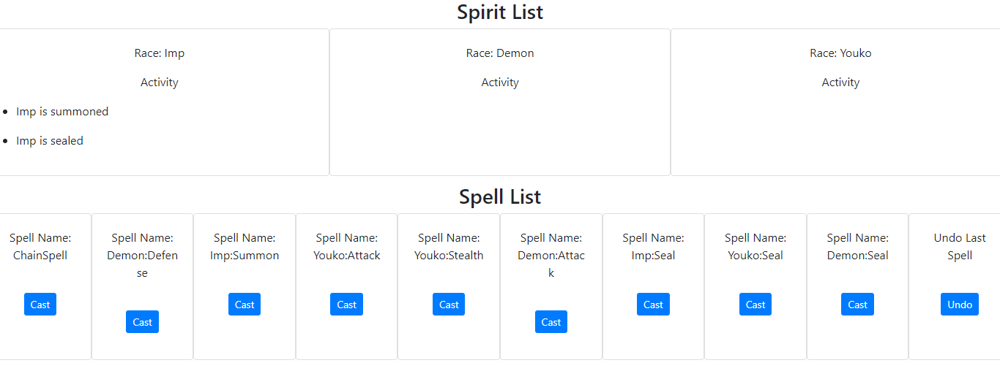
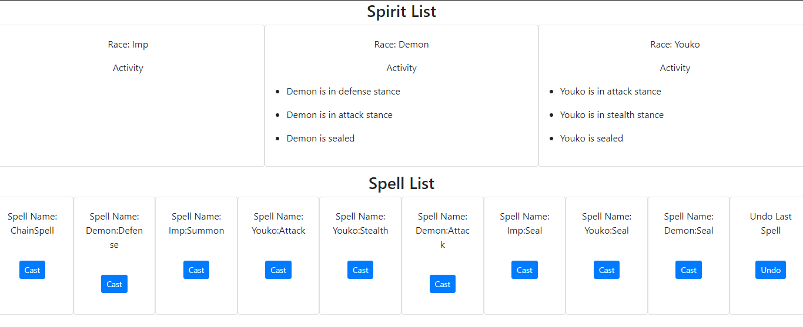
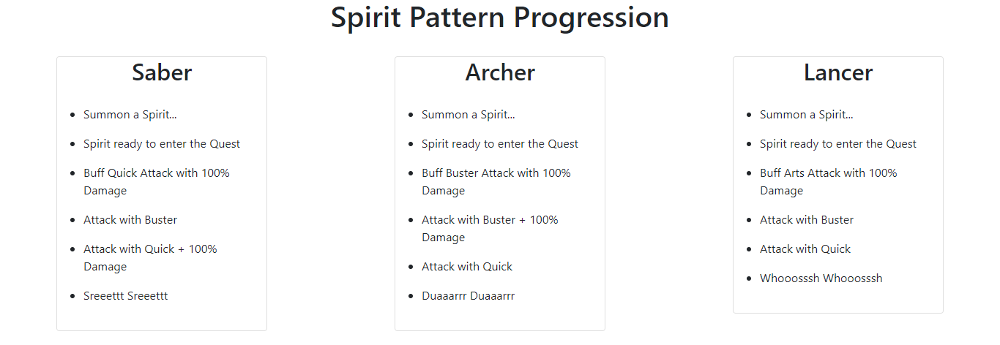

# Tutorial 2

# I can Actually Contract and Fight Alongside Spirits in This World

Setelah pada tutorial sebelumnya (tutorial-1), Anda telah menjalankan amanah untuk membantu ***guild*** dalam mempersiapkan strategi ***adventurer*** dan pembagian ***quest*** menggunakan sihir bernama Spring, dimana sihir ini menggunakan pemahaman Advanced Programming yang Anda miliki. Kali ini di `tutorial-2` kita akan mencoba menggunakan sihir Spring untuk berinteraksi dengan ras halus bernama ***spirit***.


## (Command Pattern)
------------------------
Dengan menggunakan sihir Spring, anda mencoba membuat sebuah ***contract seal*** yang dapat digunakan untuk mengontrak ***spirit*** dan memberikan instruksi pada ***spirit*** yang dikontrak. Namun, sebagai manusia yang muncul dari dunia dengan peradaban yang lebih maju yang mengenal kode etik, anda tidak ingin kontrak yang anda buat disalahgunakan oleh pihak yang tidak bertanggungjawab. Anda akhirnya menghindari kontak langsung antara ***contract  seal*** dengan ***spirit*** dengan membuat perantara berupa **`spell`** yang merupakan satu instruksi spesifik untuk satu ***spirit***.

Akhirnya, anda mencoba merancang ***contract seal*** anda. Pertama, anda membuat sebuah `interface` berupa **`spell`**, yaitu `Spell.java`. `Interface` ini akan diimplementasikan menjadi beberapa instruksi yang dapat dilaksanakan ***spirit***. **`Spell`** juga dapat melakukan `undo` instruksi jika diperlukan. ***Perlu diingat, ketika `spell` anda menginstruksikan `undo`, ***spirit*** akan menjalankan hal terakhir yang mereka lakukan. Terlepas dari `spell` yang menginstruksikan `undo`.***

Langkah selanjutnya adalah merancang **`seal`** berupa `ContractSeal.java` yang akan menyimpan berbagai **`spell`** yang sebelumnya sudah diimplementasikan. **`Seal`** yang anda buat dapat menyimpan beberapa **`spell`**. Karena instruksi `undo` yang masih kurang stabil, anda membatasi penggunaan instruksi `undo` dimana **`seal`** anda tidak memperbolehkan pelaksanaan instruksi `undo` dua kali berturut-turut.

Implementasi **`seal`** anda terbagi menjadi 4 bagian, yaitu ***controller***, ***core***, ***repository***, dan ***service***.

1. Pada ***controller*** terdapat `SealController.java`, anda diminta untuk melengkapi endpoint `cast` dan `undo` pada ***controller***.
    ```java
    ...
    ...
    @RequestMapping(path = "/cast", method = RequestMethod.POST)
    public String castSpell(@RequestParam(value = "spellName") String spellName) {
        // TODO: Complete Me
        return "redirect:/seal";
    }

    @RequestMapping(path = "/undo", method = RequestMethod.GET)
    public String undoSpell() {
        // TODO: Complete Me
        return "redirect:/seal";
    }
    ...
    ...
    ````

2. Bagian ***core*** merupakan inti dari pekerjaan anda. ***Core*** terbagi lagi menjadi 2 bagian, yaitu **`spell`** dan ***spirit***.
	I. Spirit
	
	Spirit terbagi menjadi 2 kelas, yaitu:
	>> a. `Familiar`. Merupakan ***spirit*** tingkat rendah yang hanya dapat di`activate` atau di`seal`.

    >> b. `High Spirit`. Spirit dengan intelegensi yang lebih tinggi, sehingga mengerti setidaknya kemampuan dasar bertarung seperti `attack`, `defend`, dan `stealth`. Seperti `Familiar`, `High Spirit` juga dapat di`seal`.
	
	II. Spell
	
	Ada beberapa implementasi **`spell`** pada bagian ini. Implementasi tersebut dapat dibagi menjadi 4 bagian.
	>> a. `Familiar Spell`. Merupakan ***spirit*** tingkat rendah yang hanya dapat di`activate` atau di`seal`.

    >> b. `High Spirit Spell`. Spirit dengan intelegensi yang lebih tinggi, sehingga mengerti setidaknya kemampuan dasar bertarung seperti `attack`, `defend`, dan `stealth`. Seperti `Familiar`, `High Spirit` juga dapat di`seal`.
	
	>> c. `Chain Spell`. Gabungan beberapa **`spell`** yang dijalankan secara berurutan. ***Instruksi `undo` pada `spell` ini sedikit berbeda, dimana `chain spell` melakukan `undo` pada setiap `spell` yang menyusunnya dengan urutan terbalik.***.
	
	>> c. `Blank Spell`. **`Spell`** tanpa instruksi. Cocok untuk bluffing atau distraksi.
	
3. Bagian ***repository*** merupakan tempat dimana anda merancang **`Contract Seal`** anda. Anda melakukan implementasi sesuai rencana awal.
    ```java
    ...
    ...
    public void castSpell(String spellName) {
        // TODO: Complete Me
    }

    public void undoSpell() {
        // TODO: Complete Me
    }
    ...
    ...
    ````

4. Terakhir, bagian ***service***. Anda mengimplementasi ***service*** yang dapat digunakan ***controller*** untuk melakukan `cast` atau `undo` pada `Contract Seal`.
    ```java
    @Override
    public void castSpell(String spellName) {
        seal.castSpell(spellName);
    }

    @Override
    public void undoSpell() {
        seal.undoSpell();
    }
    ````
	
Untuk membantu pengecekan progress perancangan, anda membuat TODO List yang berkaitan dengan implementasi **`Contract Seal`** ini.

### Example
Berikut contoh tampilan sistem yang telah terimplementasi dengan baik.

*Command Pattern Frontend*

 *Simulasi Chain Spell (setelah klik tombol Chain Spell)*
 *Simulasi Summon dan Seal Familiar (setelah klik tombol Summon dilanjutkan dengan tombol Seal)*
*Simulasi Spell pada High Spirit (setelah klik tombol Attack-Stealth-Seal pada Youko dan Defense-Attack-Seal pada Demon)*

### TODO List Contract Seal
- [ ] Mengimplementasikan semua implementasi `Spell.java`.
- [ ] Mengimplementasi `cast` dan `undo` pada `ContractSeal.java`.
- [ ] Mengimplementasi `cast` dan `undo` pada `SealServiceImpl.java`.
- [ ] Mengimplementasi `cast` dan `undo` pada `SealController.java`.

## (Template Pattern)
------------------------
Setelah, para ***adventurer*** melakukan ***contract seal*** dengan ***spirit*** , selanjutnya terdapat ***quest*** yang harus dijalankan para ***adventurer***. ***adventurer*** memiliki ***skill*** spesial pada ***quest*** dan menggunakan ***spirit*** yang akan membantu mereka menjalankan ***quest***.

Disini para ***spirit*** akan melakukan ***movement*** secara spesifik sesuai dengan jenisnya. Terdapat 3 jenis spirit, yaitu : Saber, Archer, Lancer yang siap membantu ***adventurer***. Ketiga jenis spirit memiliki pola ***movement*** yang sama, namun setiap jenis spirit memiliki ***movement*** buff yang menambahkan ***damage*** kepada ***movement*** serangan yang berbeda. Untuk membantu ***adventurer*** kalian disini menentukan urutan ***movement*** pada ***spirit***. Silahkan menentukan pola ***movement*** yang menurut kalian **paling baik** untuk spirit. **Hint: Ingat kembali cara spirit bekerja pada command pattern.**

### Example
Berikut contoh tampilan sistem yang telah terimplementasi dengan baik.

 *Template Pattern Frontend*

### TODO List Template
- [ ] Mengimplementasikan pola ***movement*** setiap spirit pada `SpiritInQuest.java`

## Notes
Tugas kalian pada 2 Pattern diatas adalah melengkapi tiap implementasi yang ditandai oleh `//TODO: Complete me`.

PS: Perhatikan `import` pada setiap kode implementasi, terutama bagi kalian yang tidak memakai Intellij.
