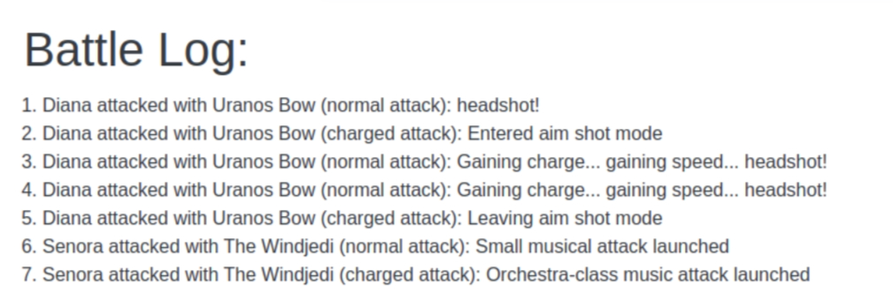

# J̴̪̟̺̅̽͗̚̚͝Ȗ̷̦̈́͆̍̚S̷̝̖̐̃͑̈́͑͠ͅT̷̨̺̣̻̩͐̇̎ ̷̤̠̼̮̾͌̊̀͆͘E̴̦̮̤̫͐̊̓̀͝͝M̸̭̤͈̬̌͑̀̉̏̕P̷̡͖͐́̏͠Ṫ̸̛͓̜͖̦̜̞͌̇̋̋Ÿ̶̧́͗̆͠ ̴̛̰͙̉̂͠͠Ḽ̷̱̇͂͊͑̍ͅI̴̲̤͖̭͂̂͂͑̊͘S̸̠̀̾͐̉͘Ţ̸͉̹̼̞́͆̽͑͝

## Adapter Pattern
Pada `tutorial-3` kali ini, terdapat seorang adventurer veteran yang telah menyelesaikan banyak sekali *dungeon* sehingga memiliki koleksi senjata.
Adventurer ini kini ingin mengajak teman-teman pemulanya untuk bertualang bersamanya.

Ada 3 jenis senjata yang dimiliki adventurer veteran ini, yaitu:
> **Spellbook**: Senjata berbasis sihir. Ada dua tipe serangan yang dapat dilakukan, yaitu menembakkan spell lemah (**smallSpell()**) dan menembakkan spell kuat (**largeSpell()**).

> **Bow**: Senjata busur dan panah. Seseorang dalam memanah bisa menembakkan secara spontan, atau konsentrasi dan menembakkan panah yang lebih akurat ke titik lemah musuh (Aim Shot). Hanya ada 1 tipe serangan yang dapat dilakukan yaitu **shootArrow(isAimShot)** yang dimana *isAimShot* menyatakan metode mana yang dilakukan oleh pemanah.

> **Weapon**: Senjata umum yang sudah terstandarisasi. Ada dua tipe serangan yang dapat dilakukan, yaitu **normalAttack()** yang ringan, dan **chargedAttack()** yang lebih berat.

Masalah muncul ketika teman-teman pemula ini hanya bisa menggunakan senjata **Weapon**. Untuk mengakomodasi teman-temannya ini, veteran ini membuat **BowAdapter** dan **SpellbookAdapter**, dua buah item yang membuat menggunakan **Bow** dan **Spellbook** berasa seperti menggunakan **Weapon**. Spesifikasi "normalAttack" dan "chargeAttack" tipe-tipe weapon baru adalah sebagai berikut:

> **Spellbook:**
>> **normalAttack()**: Menembakkan spell lemah 
>> **chargeAttack()**: Menembakkan spell kuat jika memungkinkan. Sebuah spellbook tidak dapat menembakkan dua buah spell kuat secara beruntun.

> **Bow:**  
> Memiliki dua buah mode menyerang yaitu **mode spontan** dan **mode aim shot**. Pada awalnya, penyerang dalam **mode spontan**
>> **normalAttack()**: Menembak panah **secara spontan** jika dalam **mode spontan** dan menembak panah dalam **aim shot** jika dalam **mode aim shot**  
>> **chargedAttack()**: Ubah mode menyerang pengguna (dari spontan menjadi aim shot, atau dari aim shot menjadi spontan)

Tugas pertama kalian mengatur konfigurasi-konfigurasi hingga semua tipe senjata dapat dipakai sebagai **Weapon**

Selanjutnya, mereka mulai bertualang. Tak disangka mereka langsung menemukan boss! mereka pun langsung mengambil posisi untuk melawan boss ini. Setiap saat, seseorang dari *party* ini dapat menyerang. Semua aksi *party* dicatat dalam **battle log**

 Tugas kedua kalian adalah melengkapi implementasi **log**, yaitu aksi-aksi yang dilakukan oleh *party* member selama melawan boss ini. Berikut contoh **battle log**:

 

 ### TODO List Adapter:
 - [ ] Melengkapi implementasi deskripsi serangan senjata-senjata pada **core**
 - [ ] Melengkapi implementasi **BowAdapter**
 - [ ] Melengkapi implementasi **SpellbookAdapter**
 - [ ] Melengkapi **service**, **controller**, dan **template** agar weapon beserta penggunanya dapat ditampilkan di web.
 - [ ] Melengkapi implementasi fitur **log** sehingga semua aksi *party* tercatat dan ditampilkan di web.
 - [ ] Membuat kode test untuk setiap class pada package **core** sehingga semua kode pada core teruji.
 - [ ] Menampilkan *badge* code coverage dari project pada README ini.

 ### Tampilan aplikasi

 Tampilan aplikasi lengkap bisa dilihat di: https://files.catbox.moe/2v6g5p.png

### Catatan Tambahan

Pada tutorial ini kalian bebas berkreasi selain pada class yang ditandai tidak boleh diubah. Beberapa contoh hal yang dibebaskan:
- Teks yang dikembalikan saat serangan **weapon** bebas.
- Bebas menambahkan attribut atau method baru ke dalam class pada **core**, **service**, **repository**, dan **controller**.
- Teks pada **battle logs** bebas, asalkan informatif dan tidak mengurangi informasi dari yang diberikan contoh.

## E̴̮̎̆̚t̵͚͙͙̂̅͘ȩ̸̰̉̃̓̃͜͜͝r̵̤̲̙̈͛̍̏̚n̵̞̻̘͛̌̐̕ą̵̡̗͛́̂͘l̸̝̬̠̆́ ̴̪͖͍̺̆̓̐͝S̴̟̬̹͂͌̍͒i̶̺͙̻͍͖͕̋̃n̷̫̄͊̆̈́͝g̵̠̐̔̀u̷̙̯̞̽͑̿ͅl̵̦̹̋͂̈́͋͒͒à̸̰̺͙̫̔ŗ̷͉̱̜̣̌̍̆̓̕ǐ̶̖̳ṯ̵̦͖̻̤̖͒̾́̊́̀ỹ̶̤͇̝͓͇̇
̦͇̗͕͔̖̭"̷̪͆̒B̵̘̗͝ḯ̷̭s̸̪̓ą̵̺̈k̶͖̘̃ą̵͍̐̔ḣ̷̠͝ ̷̨̤͆̌k̸̭͑̊a̶̎͜u̴̲̽̔ ̵̙̠͗̆m̶̫͋̇e̴͈̺͊n̸͉̓d̸͇͕͌͑ȩ̵̂n̷̲͑g̸̖̏â̷̪͎̓r̶̻̂̍k̴̝̿͘u̷͍͛́?̴̬͋͠?̶̦͆̓"̷͓͒͌ Sebuah suara tiba-tiba terdengar.
Namun, anda hanya bisa mendengar suara tersebut, tanpa sama sekali memahami apapun yang diucapkan. 

"Bisakah anda mengulanginya sekali lagi?" pinta anda.

"̶̹͕̍̈Ȧ̸̡k̸̳͎͗̉u̷̞̝͒̀ ̸̙͖̅̂a̷̖̓d̸̪̺͌a̶̰̥̒̀l̷͖̻̿͛ä̵̹̺́ḥ̸̩̓͒ ̴̹̳̆́[̷͖̪̕]̷̩̽͐"̶̤͕̀̄. Suara itu sekali lagi mengatakan sesuatu. Seperti gumaman yang anda tak pahami. Namun, dari gesturnya anda paham bahwa dia sedang memperkenalkan dirinya.
Paham bahwa anda tidak bisa memahami perkataannya, suara itu meminta anda untuk mengikutinya.

Memori anda terasa sangat jauh. Kumpulan serpihan informasi tampak tak beraturan. Di koridor panjang yang anda lalui ini
semuanya terasa hampa, ia tampak palsu. Sementara ingatan yang merupakan representasi kenyataan yang anda
miliki terasa seperti mimpi yang dilupakan. Suatu paradoks di ruang sempit ini. 

Kaki anda membawa anda menjauh. Walau kesadaran anda ada di sana, ia tampak tertidur. 
Anda tak merasakan apapun di ruang ini. Udara yang harusnya ada dan anda hirup tidak terlihat di sepanjang
mata. Sepertinya bahkan yang terjadinya adalah sebaliknya. Oleh karena anda hidup, anda bernafas. 
Hal yang jelas saja tidak masuk akal memang, seolah sebab dan akibat telah berubah peran.

"Kalau di sini harusnya anda dapat memahami saya. " ujar suara di hadapan anda lagi. Wujudnya mulai terlihat.
Ia mengangkat tangannya dan meletakkannya di dada kirinya.

"Namaku adalah Ą̸͎͐k̶͓̾͝u̵̪͒ ̸͉͂G̷̨̰͐͗a̷̭̞͋n̸͎̰̉t̵̩͈̃ę̸̖̽n̶̟̤͆g̵̨̈́͑" Ia memperkenalkan dirinya kembali kepada anda. Namun, ada satu kata yang masih tidak bisa anda pahami.
Tidak. Hal itu mungkin tidak tepat. Anda tidak bisa mendengar kata itu sejak awal. 

"Aku akan mengantarkan ke tempat anda seharusnya. Beberapa tahun di masa depan."Saat suara
itu mengatakan hal tersebut, anda tidak bisa berkata sepatah katapun. Anda hanya menganggukkan kepala.

"Anda harusnya tidak berada pada zaman ini. Sepertinya anomali waktu terjadi saat pemanggilan anda kembali ke alam ini."
Anda semakin tidak paham apapun yang diucapkan suara itu. Seolah satu-satunya hal yang bisa dilakukan adalah menerima apapun yang ia katakan.

Cahaya terang lalu menyinari ruang sempit ini. Secara reflek anda menutup mata karena sinar yang menyilaukan. 
Anda tidak bisa melihat, tapi anda mulai bisa merasakan. Anda juga mulai membuka mulut anda. "Terima kasih" pinta anda.
"Selama itu memang pekerjaan yang harus aku selesaikan, akan aku lakukan."

Anda sudah tahu apa yang menanti anda di depan. Anda pernah membacanya. Suatu kisah mengenai perjalanan seorang
*programmer* di dunia penuh sihir. Suara itu lalu tiba-tiba mendekat, menepuk pundak anda.

"Anda sudah melihat kisah ini bukan?" katanya. "Apa anda berpikir akhir cerita ini akan sama seperti sebelumnya, seperti tahun lalu, wahai mahasiswa?"

Kata terakhir itu mengagetkan anda. Anda tidak sempat merespon. Anda mendengar dia mengatakan 
sesuatu lagi. "S̶̢̠̒ḙ̷̙͝m̵̢͚̈́o̵̜̍ĝ̷̟̻â̶̫̺͝ ̴̼̠̊b̸̨̓̆e̵̗͋͠ŕ̴̟̘u̷̻̼͘͝ǹ̴̖̪́t̵͖̾̊u̸̬͆̕n̸̡̍g̷̯̒̚͜    " katanya.
Namun, lagi anda tidak memahaminya. Kesadaran anda lalu menghilang. 

## Realis, Kota yang Terbuang
Anda membuka mata Anda, lalu melihat lingkungan di sekitar anda namun anda hanya melihat satu warna dominan di tempat tersebut:
coklat, lebih tepatnya, warna coklat yang sama dengan warna yang dimiliki pasir.

*Aku sekarang ada di mana?*

Anda kemudian mencoba berjalan tanpa arah. Dari setiap arah, sudut, dan jarak, Anda hanya melihat dataran pasir berwarna coklat.
Dari setiap arah, pohon sekecil apapun, hewan sekecil apapun, dan mata air sesedikit apapun, tidak terlihat oleh Anda.
Ya, Anda berada di sebuah di sebuah tempat tanpa tanda-tanda kehidupan. Meskipun begitu, Anda memutuskan untuk tetap berjalan.

Setelah Anda berjalan selama kurang lebih 3 jam tanpa henti, akhirnya Anda melihat sesuatu selain dataran pasir.
Bangunan-bangunan terbuat dari batu, kayu, dan bahan-bahan lainnya yang Anda tidak tahu namun Anda tahu pasti bahwa di tempat tersebut pasti ada sekumpulan manusia,
paling tidak, di tempat tersebut *sempat ada* sekumpulan manusia. Anda memutuskan untuk berlari ke tempat tersebut.

Sesampainya Anda ke tempat dengan kumpulan bangunan tersebut, seorang perempuan berdiri di depan gerbang masuk tempat tersebut.
Perempuan tersebut kemudian menyapa Anda dengan ramah.

"Selamat datang di Realis, Kota yang Terbuang. Adakah yang bisa saya bantu, Tuan Musafir?"

Anda pun menyapa perempuan tersebut lalu Anda meminta tempat untuk beristirahat. Perempuan tersebut kemudian mengantarkan Anda ke sebuah "penginapan".
Anda pun melihat "penginapan" tersebut dan Anda pun terkagum-kagum melihat "penginapan" tersebut karena "penginapan" ini merupakan bangunan paling besar megah di kota ini, meskipun terlihat tidak terawat.

"Sekali lagi, selamat datang di Realis, Kota yang Terbuang. Nama saya Charlotte van Sancta Sophia dan saya merupakan adipati dan pemerintah kota ini,
meskipun gelar-gelar tersebut sudah tidak ada artinya."

Anda pun menanyakan banyak hal kepada Nona Sancta Sophia seperti sejarah kota Realis, keluarga Sancta Sophia, kehidupan yang terjadi di Realis, dan lain-lain.
Namun, jawaban yang diberikan Nona Sancta Sophia membuat Anda terkejut, takut, dan merinding di saat yang sama.

"Sejak setahun lalu, makhluk-makhluk surgawi meninggalkan kami. Oleh karena kejadian tersebut, mata air mulai mengering satu per satu,
tumbuhan-tumbuhan menjadi layu dan kemudian mati, hewan-hewan terbaring tidak berdaya dan menjadi tulang belulang, dan manusia pun kembali menjadi debu dan tanah.
Saat ini, penghuni kota ini hanya saya seorang"

Mendengar jawaban tersebut, Anda tidak bisa berbuat apa-apa. Anda pun langsung berpikir untuk segera pergi dari Realis untuk menghindari masalah yang dialami kota tersebut.
Namun, saat melihat Nona Sancta Sophia, Anda tidak bisa memutuskan untuk melakukannya.

"Mohon bantu saya, Tuan Musafir. Bantu saya menjadikan Realis kota yang hidup dan makmur kembali".

Mendengar perkataan Nona Sancta Sophia, Anda tidak punya pilihan selain membantunya.

## Facade Pattern

Ekosistem di Realis ditopang oleh energi yang disediakan oleh benda sihir bernama *Arcanum Monolithium*.
Arcanum Monolithium **ditulis dengan suatu *codex* kuno yang disebut `RunicCodex`**.
Supaya Arcanum Monolithium bisa berfungsi sesuai dengan semestinya, berkat dari makhluk-makhluk surgawi dibutuhkan sebagai bahan bakar benda tersebut, atau paling tidak itulah yang dikatakan oleh Nona Sancta Sophia.

"Jadi, kalau benar seperti itu, bukankah artinya benda sihir ini sudah tidak bisa digunakan lagi?", tanya Anda kepada sang adipati.

"Tanpa bantuan Anda, Arcanum Monolithium tidak akan berfungsi dengan semestinya dan Realis tidak akan kembali hidup. Namun, ada cara untuk mengembalikan Arcanum ke keadaan semula tanpa berkat dari makhluk surgawi dan hanya Anda yang bisa melakukannya", jawab Adipati Sancta Sophia. Jawaban tersebut membuat Anda semakin bingung.

"Bagaimana saya bisa membantu memecahkan masalah ini?"

"Pertama, Arcanum Monolithium **ditulis dengan sebuah *codex* kuno bernama `RunicCodex`**.
Namun, <u>*codex* yang digunakan sehari-hari</u> oleh masyarakat Realis **adalah `AlphaCodex`**.
Untungnya, cendikiawan-cendikiawan Realis berhasil menemukan cara untuk **menerjemahkan `AlphaCodex` menjadi `RunicCodex` dan sebaliknya**. Namun, <u>penerjemahan saja tidak cukup</u> untuk mengembalikan kembali fungsi Arcanum Monolithium. Arcanum Monolithium **harus ditulis dengan `RunicCodex`** dan harus diberkati oleh makhluk-makhluk surgawi. Paling tidak, itulah satu-satunya cara untuk menghidupkan Arcanum Monolithium sampai akhirnya cendikiawan Realis berhasil menemukan rahasia dibalik pemberkatan oleh makhluk-makhluk surgawi"

"Lalu, apa rahasia dibalik pemberkatan tersebut?"

"Pemberkatan makhluk-makhluk surgawi <u>terdiri dari empat proses transformasi</u>:
**`CelestialTransformation`**, **`AbyssalTransformation`**, proses **penerjemahan dari `AlphaCodex` menjadi `RunicCodex`** (**`CodexTranslator`**) dan...."

"Dan?"

"Proses **transformasi keempat hanya diketahui oleh Anda**, Tuan Musafir."

"Apa maksud Anda?"

"Saya tahu Anda memiliki kekuatan surgawi. Kekuatan untuk menciptakan sesuatu menggunakan sesuatu yang menyerupai sihir. Saya yakin Anda bisa menciptakan proses transformasi keempat tersebut"

Anda pun merenungi jawaban dari sang adipati. Apakah ini artinya Adipati Sancta Sophia mengetahui apa itu *programming*? Anda merasa jawaban Nona Charlotte tidak masuk akal namun semenjak Anda masuk ke dunia lain ini, hal-hal tidak masuk akal terjadi setiap saat. Ini bukanlah pertama kalinya Anda mengalami hal tersebut.

"Sebelum saya lupa, Tuan Musafir. Saya ingin melakukan replikasi Arcanum Monolithium di beberapa tempat untuk mengembalikan kehidupan di beberapa tempat tidak jauh dari Realis,
jadi kita harus melakukan <u>**transformasi terbalik dari** tulisan pada Arcanum Monolithium yang tertulis dalam **`RunicCodex` menjadi tulisan dengan *codex* yang kita kenal**: bahasa yang ditulis dengan **`AlphaCodex`**</u>. Tentu saja, **transformasi terbalik tersebut <u>harus mengembalikan hasil yang sama dengan kalimat sebelum dilakukan transformasi untuk Arcanum Monolithium</u>**"

Setelah mendengarkan penjelasan sang adipati, Anda pun mulai menganalisa masalah dan membentuk solusi yang tepat untuk masalah ini.

Masalah ini memiliki proses dan sistem yang cukup kompleks namun sebenarnya apa yang dibutuhkan cukup sederhana, yaitu transformasi dari bahasa Realis ke bahasa Arcanum Monolithium dan sebaliknya.
Saat Anda mengingat-ingat apa yang sebelumnya Anda pelajari, Anda menemukan solusi yang tepat.
*Design Pattern* yang dapat digunakan untuk menyembunyikan sistem yang kompleks dengan melakukan enkapsulasi terhadap sistem kompleks tersebut dengan memberikan akses sederhana pada sistem untuk memenuhi kebutuhan program: **Facade Pattern**.

Setelah Anda selesai melakukan analisa, Anda pun akhirnya membantu Nona Sancta Sophia untuk menghidupkan kembali Realis, dimulai dengan menghidupkan kembali Arcanum Monolithium.

### TO DO List untuk Facade Pattern
- [ ] Perhatikan dan pahami keterhubungan antarkelas pada *package* `core`
- [ ] Melakukan implementasi Facade Pattern (baca `FacadeServiceImpl` untuk petunjuk)
- [ ] Melengkapi metode-metode pada `FacadeServiceImpl`
- [ ] Membuat kelas transformasi baru
- [ ] Memasukkan kelas transformasi baru tersebut ke dalam langkah transformasi
- [ ] Membuat *test* untuk metode `encode(String text)` dan `decode(String text)` pada `FacadeServiceImpl`
- [ ] Membuat *test* untuk setiap kelas dan metode yang Anda buat
- [ ] Bonus : Membuat implementasi langkah-langkah eksekusi transformasi yang tidak bersifat *hard-coded*
