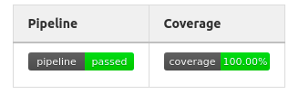

#  MVC, REST API, dan Data persistence

## Prologue of The End

Di hadapan anda ada seorang gadis, sepertinya sebaya anda. Ia mengenakan gaun hitam dengan bis putih. Ia seperti terjebak di dunianya sendiri, di dalam buku yang sibuk ia baca. Mata biru bulatnya sibuk menelusuri kata demi kata. Terkadang ia tersenyum kecil, terkadang ia menangis, terkadang ia hanya diam sembari memain-mainkan jari-jari kecilnya. Terkadang ia sama sekali tidak bergerak, masuk ke dalam tulisan-tulisan. Bahkan sapaan angin yang mengusik rambut pirangnya pun tidak ia gubris. Ia begitu masuk ke dalam dunianya.

“ Ah maaf. Anda sudah datang “ Si gadis, setelah entah berapa menit berlalu, pada akhirnya menyadari kehadiran anda.

Anda belum tahu dia siapa. Anda bahkan **belum pernah** bertemu dengannya. Namun, ketika anda melihat sosoknya yang anggun, entah kenapa anda paham bahwa ia memiliki jawaban dari pertanyaan anda.

“ Tempat apa ini? “

“ Aku senang anda bertanya. “ jawabnya semringah.

In adalah kisah dari dunia yang ditinggalkan. Bukan, itu tidak tepat. Ini adalah **world’s end compendium**, kumpulan dunia yang telah berakhir. Tidak bisa diselamatkan. Bagaimanapun semua yang ada di sini telah berakhir. Hanya ingatan dari mereka yang tersisa. Yang anda lakukan tidak lain hanya memainkan sebuah skenario palsu yang akan berujung pada akhir dunia, apapun pilihan yang anda ambil. Sederhananya, neraka untuk para penyelamat dunia. Tempat mereka dipaksa untuk menyaksikan akhir dunia berkali-kali.

Realis, Teyney, Pheamarah, Eviobis, Ateorea. Nama-nama dari dunia tersebut. Anda masih ingat saat-saat anda berjalan dan membantu orang-orang di sana. Lalu semuanya hancur begitu saja di hadapan mata anda. Tawa berganti tangisan. Semarak kota berubah menjadi teriakan putus asa. Bahkan anda masih bertanya kenapa anda masih waras setelah semua itu.

Tidak ada keselamatan di tempat ini. Memilih mereka yang pantas adalah satu-satunya tujuan tempat ini. Tidak lebih, tidak kurang. Sebuah neraka hidup dengan tujuan menghasilkan pahlawan terkuat. Simulasi kehancuran dunia. Sebuah ujian buat para pahlawan. Hanya mereka yang memiiki tekad baja yang akan mampu keluar dari tempat ini dengan masih mempertahankan kewarasan mereka.

“ Tidak ada yang palsu di sini. Tapi, di saat yang sama tidak ada yang asli. Berasal dari dunia-dunia terdahulu yang berada di akhir hayatnya. Namun, di saat yang sama bukan realita yang sebenarnya. “

“ Dunia-dunia? “ pinta anda.

“ Ada banyak dunia di alam ini. Semuanya memiliki kisah mereka sendiri. “ Gadis itu berhenti menjelaskan dan menoleh ke samping.

Anda masih menyimpan pertanyaan. Namun, anda memilih diam dan melihat ke arah yang sama dengan gadis itu.

“ Ikut denganku. Di sini tidak aman. “

## Penyesalan

Anda masih tetap diam, menatap lekat-lekat gadis di hadapan anda. Ia baru saja selesai memperkenalkan dirinya.

“ Aku sama seperti anda, seorang yang dipanggil dari dunia lain. Mudahnya, kita dari dunia yang sama. “ ucapnya.

Untuk membuat program di dunia lain? Kau tidak mau berkomentar apa-apa soal betapa anehnya hal tersebut? Bisik anda.

Anda tidak bisa tidak berkomentar seperti itu melihat tingkahnya. Ia benar-benar telah melebur dengan tempat ini. Pakaiannya layaknya gadis-gadis bangsawan yang anda lihat sebelumnya di tempat ini. Ia juga dengan santainya membaca buku-buku dari dunia ini, dengan tulisan-tulisan yang bahkan anda enggan membacanya. Ia sudah terpisahkan dari neraka yang berpura-pura menjadi dunia ini.

“ Aku tahu anda punya banyak pertanyaan. Tapi, aku yakin ini cukup untuk menjawab segalanya. Aku merasa aku dapat belajar banyak dari sini. Jika berkeluh kesah hanya membuatku menjadi orang yang lebih lemah. “

“ Kau tidak mau kembali? “ Anda menatap serius padanya, memberi tanda bahwa ini adalah pertanyaan penting.

“ Belum saatnya. “ balas gadis itu lirih. Ia berjalan ke suatu gedung, mengisyaratkan ke anda untuk mengikuti. “ Karena kita berada di posisi yang sama, memiliki kemampuan dari bidang yang sama, aku ingin anda membantuku dengan sesuatu. Penyesalan kecilku.“

## Memento dari Mereka yang Kurindukan

Entah kenapa ini terasa familiar. Anda melihat aplikasi yang sudah dikembangkan gadis itu. Banyak pertanyaan muncul. Anda bisa paham ia ingin membuat sebuah sistem informasi, tapi kenapa dia ingin membuat sebuah sistem informasi untuk mengatur asisten dosen? Anda bahkan tidak melihat ada satupun manusia lain di sini.

“ Aku tahu apa yang ada di pikiranmu. Aku membuat reaksi yang sama dulu. “ Gadis itu tertawa kecil. Matanya berbinar-binar. Sikap yang membingungkan anda.

“ Apa anda pikir hanya kita manusia yang dipanggil ke sini? “ Pernyataan gadis itu menyentak anda. Hal itu belum terpikirkan sebelumnya oleh anda.

“ Ini adalah aplikasi pertama yang ku coba buat bersama beberapa orang yang juga dipanggil ke dunia ini. Sayang sebelum kami berhasil menyelesaikannya, dunia tersebut hancur. Aku tidak bertemu dengan mereka lagi untuk sekian lama dan berjalan sendirian. Aku tidak pernah bisa menyelesaikannya. “

Kenapa? Itu hal yang ingin anda utarakan. Namun, kata itu akhirnya tidak keluar dari mulut anda. Tidak setelah anda melihat baik-baik gadis itu. Ia mungkin tampak tegar, tapi matanya berkaca-kaca. Dunia awal tempat mereka dipanggil hancur. Teman-temannya hilang pada proses tersebut. Ia lalu berjalan sendirian. Entah berapa lama. Dari cara bicaranya, caranya bersikap yang awalnya anda tidak bisa pahami, anda tahu ia sudah berjalan lama di sini. Mengapa gadis yang terlihat tidak jauh berbeda dengan anda memiliki pola pikir layaknya seorang

“ Aku merasa ini akan menjadi penyesalan yang ku bawa hingga mati jika tidak ku selesaikan. Aku ingin menyelesaikan. Bagaimanapun aku harus menyelesaikannya. Namun, namun.. aku..“ kata-katanya terhenti. Dia terdiam, menundukkan kepalanya. Anda tidak bisa dengan jelas melihat wajahnya, tapi anda tahu, ia menangis. Terisak di balik rambut pirangnya.

Bingung pasti menjadi hal pertama yang ia rasakan ketika dipanggil ke dunia ini. Anda yakin teman-temannya sangat berarti baginya. Orang-orang yang sama-sama paham kekesalannya, kesedihan, kebahagiaannya, dan semua perasaannya yang tidak terjelaskan. Tertawa bersama, melakukan hal bersama-sama, sampai terpisah untuk alasan yang tidak bisa diterima. Entah berapa lama akhirnya ia menerima fakta bahwa orang-orang terkasihnya sudah tidak ada di sisinya, menunggu sendirian di tanah kosong ini.

Anda tahu dia mau menyelesaikannya, memento terakhir dari rekan-rekannya yang berharga. Tapi, gadis itu sepertinya tidak mampu melakukannya. Karena setiap ia mencoba melakukannya, hatinya teriris, lukanya dibuka. Rasa sakit yang ia rasakan tidak terbayangkan.

“ ..aku lemah..” Anda merasa akhirnya sedikit paham maksudnya. Kesedihannya dan kerinduannya, walau anda tidak tahu kebenarannya, terasa sangat nyata. Sehebat apapun kemampuannya bermain peran untuk menipu anda, perasaannya tidak mungkin bisa ditipu.

“ Akan ku bantu.. “ Satu patah kata dari anda cukup membangkitkan senyumnya.

## Teaching Assistant Information System

“ Pada dasarnya aplikasi ini membantu pihak fakultas dan mahasiswa dengan menawarkan lowongan pada mata kuliah yang membutuhkan asisten dan membuat mahasiswa dapat melamar pada lowongan yang tersedia. “

“ Jadi satu mata kuliah dapat menerima banyak mahasiswa? “

“ Benar. Dan mahasiswa hanya dapat menjadi asisten di satu mata kuliah. Definisi table dan beberapa API untuk mahasiswa dan mata kuliah telah berhasil kami buat. Namun, untuk fungsionalitas yang menghubungkan antara mahasiswa dan mata kuliah belum selesai. “

“ Apa saja yang harus aku sediakan? “

“ Mahasiswa dapat mendaftar ke satu mata kuliah. Untuk implementasi awal, cukup anggap semua yang mendaftar ke suatu lowongan mata kuliah langsung diterima. Mata kuliah yang sudah ada asisten tidak bisa dihapus. Mahasiswa yang sudah menjadi asisten di suatu mata kuliah tidak bisa dihapus juga. “

“ Baik. “ Anda mencatat beberapa hal penting dari detail implementasi yang belum dilakukan.

```json
[
   {
      "Month":"January",
      "jamKerja":10,
      "Pembayaran":3500
   },
   {
      "Month":"February",
      "jamKerja":40,
      "Pembayaran":14000
   }
]

```


“ Selain itu ini.. “ gadis itu berhenti sebentar untuk memperlihatkan dokumen dari model sistem yang ingin dibangun. “ Ada beberapa hal lain yang juga belum diimplementasikan. Setiap mahasiswa bekerja akan dicatat pada sebuah log.  Log merepresentasikan pekerjaan yang dilakukan oleh asisten untuk akhirnya dilaporkan kepada fakultas. Mahasiswa dapat membuat log dan sistem akan menyimpannya. Mahasiswa juga dapat memperbaharui log yang sudah dibuat, dan juga menghapusnya. Selain itu, kita perlu menyiapkan API untuk memperlihatkan memperlihatkan laporan pembayaran. Laporan pembayaran, mahasiswa dapat melihat laporan untuk bulan tertentu. API ini diharapkan mampu mengembalikan sebuah laporan yang berisikan semua pekerjaan asisten pada bulan tersebut dan sebuah **summary** jumlah uang yang mereka dapatkan.  Pada laporan tersebut diharapkan ada data bulan, jam kerja dengan satuan jam, pembayaran yang didapatkan pada satuan Greil“

“ Berapa gaji yang mereka dapatkan? “

“ 350 Greil per jam. Sebuah log dapat saja berisikan data lebih singkat dari satu jam. “

“ Dimengerti. “

“ Ah soal dokumen itu.. Aku yakin anda sadar bahwa model relasi belum selesai. Semua atribut memang sudah ada di sana, tapi hubungan antar tabel belum aku tuliskan. Apakah tidak masalah anda mencoba mencarinya sendiri? “

“ Tidak masalah. “

“ Ada beberapa cara untuk mendefinisikan relasi berdasarkan definisi tabel. One-to-one, one-to-many, dan many-to-many. Setiap hubungan tersebut sudah didefinisikan pada Spring Boot. “

“ Terima kasih. “

```
Mahasiswa

NPM: String (Primary Key)
Nama : String
Email: String
ipk: String
noTelp: String

MataKuliah

KodeMatkul: String (Primary Key)
namaMatkul: String
prodi: String

Log

idLog: integer(Primary Key, auto increment)
start: datetime
end: datetime
Deskripsi: Text

```

## REST API, Data Persistence, dan JPA Repository

Anda mencoba menelusuri code base yang diberikan gadis itu. Anda menyadari ada beberapa perbedaan dari pekerjaan anda selama ini. Sistem ini telah memiliki database dan konfigurasi untuk terhubung dengan Postgresql pada `application.properties` pada `resource`.

```
## default connection pool
spring.datasource.hikari.connectionTimeout=20000
spring.datasource.hikari.maximumPoolSize=5
## PostgreSQL
spring.datasource.url=jdbc:postgresql://localhost:5432/postgres
spring.datasource.username=postgres
spring.datasource.password=postgres
# drop n create table again, good for testing, comment this in production
spring.jpa.hibernate.ddl-auto=create
spring.jpa.database-platform=org.hibernate.dialect.PostgreSQLDialect
server.error.whitelabel.enabled=false
server.error.path=/error-spring

```

“ Aku dapat membantu menjelaskan beberapa hal. “ Anda menoleh ke belakang. Gadis itu datang sambil membawa secangkir teh.

“ Terima kasih. “

“ Konfigurasi database tersebut bisa anda utak-atik sesuai konfigurasi lokal anda. Selain itu apakah anda sudah familiar dengan REST API? “

“ Aku setidaknya memahaminya. “

“ Kami membuat sistem ini dengan REST dengan harapan, **consumer** dari aplikasi ini dapat beraneka ragam. Kami dapat membuat aplikasi web, desktop, mobile dengan API ini. Jadi apapun yang dapat menerima JSON dapat menggunakan aplikasi ini. Jika ada sistem lain yang ingin menggunakan data kami, desain ini juga fleksibel untuk mengakomodasi hal tersebut. Jadi sebagai sarana komunikasi, sistem sangat ideal. Selanjutnya adalah bagaimana cara mencoba sistem ini. Anda dapat menggunakan [Postman](https://www.postman.com/) atau **client** lain yang anda biasa gunakan. Cobalah untuk membuat beberapa data untuk mahasiswa dan mata kuliah sebelum memulai. Aku juga menyarankan untuk memperhatikan **Request Method** pada `Controller` “

“ Untuk ini.. “ anda menunjuk pada bagian kode yang menunjukkan repository. Ada interface bernama JpaRepository.

“ Aku tahu apa yang ada dipikiranmu. Tidak usah mempertanyakan kenapa interface yang tidak ada implementasinya dapat melakukan hal seperti ini. “ Ia menjawab tepat apa yang anda pikirkan. “ Hal yang perlu diperhatikan adalah nama method pada JpaRepository tidak sembarangan. “

“ Nama method ini.. Merepresentasikan sebuah Query pada database bukan? “

“ Tepat. Ada aturan dalam membuat nama method tersebut. Anda mungkin tertarik untuk mempelajarinya. Untuk pertama kali, aku rasa anda bisa memahami kode yang ada dan mencoba mempelajari pattern yang ada. Aku rasa sudah semua requirement dijelaskan. “

“ Terima kasih banyak. “

“ Ah, seharusnya aku yang berterima kasih. “

## Todo Mandatory (100 poin)


- [ ] Atur `application.properties` sesuai dengan konfigurasi database di local anda.

- [ ] Baca percakapan dan buatlah `notes.md` terhadap requirement apa yang anda temukan

- [ ] Buat model untuk sisa entity yang belum dibuat (Log dan tabel-tabel relationship antar table yang berhubungan) (jumlah relasi tergantung desain anda, dapat bervariasi)

- [ ] Buat repository untuk entity yang belum dibuat. Anda dapat menambah query method pada repository yang sudah ada apabila dibutuhkan.

- [ ] Buat Service untuk requirement yang anda temukan (2).

- [ ] Buat RestController untuk requirement yang anda temukan (2)

- [ ] Uji coba aplikasi dengan client seperti PostMan.

- [ ] Tambahkan Badge Coverage dan Pipeline pada README ini. 
  
- [ ] Buat Test untuk setiap program yang anda ubah/tambahkan. Coverage aplikasi adalah 100% dalam keadaan sekarang. Mengurangi code coverage akan mengurangi nilai anda.



## Sample Request

Sample Request (Gunakan contoh create, method POST, request body berupa JSON)
```json

{   
    "npm" : "122334",
    "nama" : "Annabelle Von Azalia",
    "email" : "annabelle.azalia@ui.ac.id",
    "ipk" : "4.0",
    "noTelp" : "123456"
}
```

Sample Response Body
```json
{
    "npm": "122334",
    "nama": "Annabelle Von Azalia",
    "email": "annabelle.azalia@ui.ac.id",
    "ipk": "4.0",
    "noTelp": "123456"
}
```

## Bonus ( 30 poin)

“ Apa sistem autentikasi belum dibuat pada aplikasi ini? “

“ Ah benar. Aku rasa itu akan penting untuk dibuat. “

“ Apa ada `auth rule` tertentu yang perlu aku buat? “

“ Aku rasa cukup jadikan `Mahasiswa` sebagai akun. Masuk dengan npm dan sebuah kolom password. Aku rasa anda butuh mengubah model mahasiswa. Untuk sementara, cukup buat, akun yang login hanya dapat mengubah resource milik akun itu sendiri.  “

“ Karena penggunaan REST, apakah saya boleh membuat Json Web Token (JWT) untuk kebutuhan autentikasi? “

“ Aku juga setuju. Kalau begitu, silahkan dibuat. “

“ baik. “

## Todo Bonus

- [ ] Ubah Mahasiswa model untuk kebutuhan autentikasi

- [ ] Buat Auth Rule sesuai dengan requirement yang dijelaskan

- [ ] Implementasikan JWT sebagai autentikasi.

- [ ] Ubah Test sesuai dengan kebutuhan untuk autentikasi menggunakan JWT. Pastikan code coverage tetap 100%

Bonus diberikan apabila berhasil meraih semua yang diminta pada todo ini.

## Perhatian
**Buat Branch berbeda dan Merge Request berbeda untuk mandatory dan bonus.**

## Hint

- [ ] Analisis requirement dengan seksama agar tidak ada yang tertinggal

- [ ] Buatlah tabel dari entitas-entitas yang dibutuhkan terlebih dahulu.

- [ ] Anda akan membutuhkan beberapa endpoint untuk menyelesaikan problem set ini. Silahkan merancang

- [ ] Pelajari hal-hal yang akan digunakan pada tutorial ini (REST, JPA, Postman, dll)

- [ ] Gunakan pendekatan basis data yang baik dalam membuat model dan query dari requirement. Perhatikan jenis hubungan antar tabel yang dibutuhkan (One-to-one, one-to-many, many-to-one, many-to-many. 
